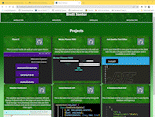

# Santor Services

## description
[Deployed Link](placeholder)
This is a reimagined portfolio page using React! It has cards for projects that I have completed, links to social media and even a form to send me a message.

| Technology Used         | Resource URL           | 
| ------------- |:-------------:| 
| CSS | [https://developer.mozilla.org/en-US/docs/Web/CSS](https://developer.mozilla.org/en-US/docs/Web/CSS)     |
| Javascript    | [https://developer.mozilla.org/en-US/docs/Web/JavaScript](https://developer.mozilla.org/en-US/docs/Web/JavaScript) | 
| React | [https://reactjs.org/](https://reactjs.org/)     |

 
## Table of Contents 
 * [Installation](#installation)
* [Usage](#usage)
* [Credits](#credits)
* [Contributions](#contribution)
* [License](#license)
* [Testing](#Testing)
* [Questions](#questions)

## Installation 
 n/a
## Usage 

## Credits 
 All this coding made possible by [Jerome Chenette](https://github.com/jeromechenette) and my fellow students who help each other along the way
## Contributions 
 n/a
## License 
 MIT
## Testing 
n/a
## Questions 
 If you have any questions you can refer to my github at this link or email me! 
 * [Github](github.com/BrettSantor) 
* b.santor27@gmail.com
